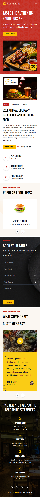

# Restaurant Website

## Live Preview

Check out the live preview of the project: [Live Preview Link](https://free-restaurant.vercel.app)

## Overview

This project is a **Figma to React conversion** that brings a design to life using **React** and **Tailwind CSS**. The application is responsive on Desktop and Phone devices and closely follows the Figma design specifications.

## Technologies Used

- **Frontend Framework**: React
- **Styling**: Tailwind CSS
- **Other Libraries**: Swiperjs, React-Router-Dom, React-Icons

## Installation and Setup

To run this project locally, follow these steps:

1. **Clone the repository:**

   ```bash
   git clone https://github.com/najim2004/restaurant-task.git
   ```

2. **Navigate into the project directory:**

   ```bash
   cd restaurant-task
   ```

3. **Install dependencies:**

   ```bash
   npm install
   ```

4. **Start the development server:**

   ```bash
   npm run dev
   ```

5. Open your browser and go to `http://localhost:5173` to view the project.

## Project Structure

The project follows a clean and organized structure to make it easy to navigate and extend:

- **`src/components/`** - Contains all reusable components
- **`src/pages/`** - Contains page-level components and layouts
- **`src/assets/`** - Holds images, icons, and other static assets

## Usage

- **Home Page**: Displays the main content and features as per the Figma design.
- **Responsive Views**: Optimized layouts for both small and large devices.

## Screenshots

### Desktop Preview


### Mobile Preview



## Contact With Me

If you have any questions, feedback, or would like to collaborate, feel free to reach out!

- **Email**: [najim.developer@gmail.com](mailto:najim.developer@gmail.com)
- **Portfolio**: [najim2004](https://najim-dev.vercel.app)
- **LinkedIn**: [in/mohammad-najim2004](https://linkedin.com/in/mohammad-najim2004)
